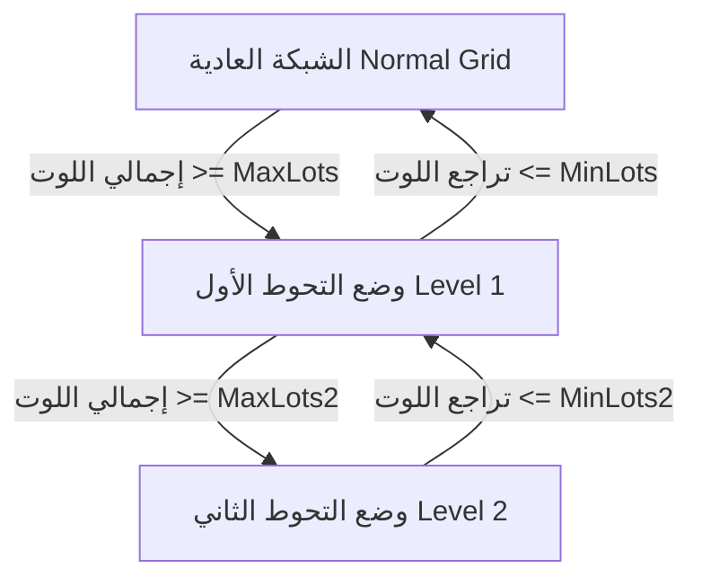

# توثيق تعديلات الإصدار SADDAM Zone EA V1.10.3

تم تحديث وتطوير الإكسبرت إلى الإصدار **V1.10.3** لحل مشكلة تضخم حجم اللوت (Lot Size Inflation) من خلال إضافة **مستوى تحوط ثانٍ موازٍ (Hedging Level 2)** مع مرونة إضافية تتيح للمستخدم تحديد نوع أوامر الحماية المعلقة.

---

## 1. المتغيرات الجديدة المضافة في الإعدادات (Input Parameters)

تمت إضافة 4 متغيرات جديدة للتحكم الكامل في المستوى الثاني من التحوط:

| اسم المتغير | النوع | القيمة الافتراضية | الوصف |
| :--- | :--- | :--- | :--- |
| **`MaxLots2`** | `double` | `20.0` | إجمالي اللوت الأقصى لأي طرف (شراء أو بيع) والذي عند وصوله يتم تفعيل التحوط للمستوى الثاني. |
| **`MinLots2`** | `double` | `5.0` | حجم اللوت المستهدف لإنهاء التحوط للمستوى الثاني والعودة الآمنة للمستوى الأول. |
| **`Step2`** | `int` | `30` | مسافة الخطوة بالنقاط (Pips) لوضع أمر الحماية المعلق (`Hedge Shield`) في المستوى الثاني. |
| **`lotType2`** | `Enum` | `PENDING_AUTO` | نوع أمر الحماية المعلق المطلوب تفعيله في المستوى الثاني. |

### خيارات نوع أمر الحماية (`lotType2`):
1. **`PENDING_AUTO`**: يقوم الإكسبرت بتحديد الاتجاه المعاكس لآخر صفقة تلقائياً (كما في المستوى الأول للتحوط).
2. **`PENDING_BUYSTOP`**: إجبار الإكسبرت على استخدام أوامر شراء معلقة فقط (`BUYSTOP`) كحماية.
3. **`PENDING_SELLSTOP`**: إجبار الإكسبرت على استخدام أوامر بيع معلقة فقط (`SELLSTOP`) كحماية.

---

## 2. آلية عمل ومسار سيناريو التحوط للمستوى الثاني

يتبع الإكسبرت دورة حياة ديناميكية لحماية الحساب عند تضخم العقود كالتالي:



### خطوة بخطوة:

1. **الانتقال من المستوى الأول إلى الثاني**:
   أثناء وجود الإكسبرت في وضع التحوط الأول (`IsHedgingMode = true`)، إذا استمر السعر بالانعكاس ووصل إجمالي العقود لأي طرف إلى `MaxLots2`:
   - يتم تفعيل متغير الحالة `IsHedgingMode2 = true`.
   - يتم مسح جميع أوامر الحماية المعلقة للمستوى الأول فوراً.
   - يتم تعزيز القفل الكامل 1:1 عن طريق فتح صفقة معاكسة جديدة عبر دالة `ExecuteLock()`.

2. **شبكة الحماية المعلقة الخاصة بالمستوى الثاني (`Hedge Shield`)**:
   عند وضع أوامر الحماية المعلقة في المستوى الثاني، يلتزم الإكسبرت بالمعاملات المخصصة له:
   - يتم استخدام `Step2` بدلاً من `Step` لتحديد البعد بالنقاط.
   - يتم استخدام `MinLots2` كحد أدنى لحجم لوت الحماية الوقائي.
   - يتم احترام خيار `lotType2` المختار من قِبلك (تلقائي، أو شراء فقط، أو بيع فقط).

3. **دورة التقليص والتراجع**:
   - يستمر الإكسبرت في تنفيذ دورة التقليص الذكية بقطع الأرباح من جانب وإغلاق جزء من الخسائر في الجانب الآخر.
   - عندما يهبط اللوت الإجمالي لأكبر طرف إلى ما دون `MinLots2 + 0.001` عقود:
     - يتم مسح جميع أوامر حماية المستوى الثاني المعلقة.
     - يتم إلغاء تفعيل المستوى الثاني `IsHedgingMode2 = false`.
     - يعود الإكسبرت للعمل تحت مظلة التحوط للمستوى الأول باستخدام الإعدادات الأساسية (`Step` و `MinLots`) حتى يتعافى تماماً ويعود للشبكة العادية.

---

## 3. التغييرات في الكود البرمجي (MQL4)

* **تعريف الـ Enum الجديد**:
  ```mql4
  enum ENUM_PENDING_TYPE
    {
     PENDING_AUTO,
     PENDING_BUYSTOP,
     PENDING_SELLSTOP
    };
  ```

* **التحكم الوقائي وتغيير شروط وضع الأوامر المعلقة**:
  تعديل دالة `OnTick()` لتقسيم وضع أوامر الحماية بين المستوى الأول والمستوى الثاني بناءً على قيمة متغير الحالة `IsHedgingMode2` لضمان عمل المعاملات المخصصة لكل مستوى بدقة شديدة دون أي تداخل.

---

## 4. إصلاح أخطاء المترجم (MQL4 Compiler Fix)

نظرًا لمحدودية مترجم لغة MQL4 فيما يتعلق بتعريف المتغيرات المحلية بنفس الاسم داخل الكتل المتداخلة (مما يسبب خطأ `variable already defined`):
* تم الإعلان عن جميع المتغيرات المساعدة (`p_lot`, `p_price`, `lastType`, `refPrice`, `t1`, `t2`) مرة واحدة فقط في بداية كتلة `IsHedgingMode`.
* تم تعديل كود الكتل الفرعية للمستوى الأول والثاني لإعادة تخصيص القيم فقط دون الحاجة لإعادة تعريفها مجدداً، مما يضمن خلو الملف من أي أخطاء أو تحذيرات عند الترجمة (Compilation).

---

## 5. تطوير وتحسين واجهة المستخدم (Premium UI & Foreground Fix)

لضمان عدم تغطية لوحة البيانات أو الأزرار بواسطة الشموع أو خطوط الشبكة وجعلها تظهر بوضوح تام وغير شفافة:
* **خلفية موحدة صلبة (Charcoal BG Panel)**: تم استبدال الخلفية الصغيرة المنفصلة بخلفية موحدة داكنة وراقية بلون الفحم الداكن (`C'20,20,20'`) تمتد خلف جميع النصوص والأزرار.
* **منع القطع والقص (Anti-Truncation)**: تم توسيع عرض صناديق النصوص من `80` بكسل إلى `180` بكسل لتتسع للنصوص الطويلة بالكامل (مثل `Cycle Closed Profit` و `Cycle Open Profit`) دون أي قطع أو ظهور نقاط `...`.
* **محاذاة ولمسة جمالية متكاملة**: تم إعطاء صناديق التسمية نفس لون لوحة الخلفية لتبدو مندمجة بشكل مسطح وراقي، مع توسيع أزرار الإجراءات (`Close All` و `TransfairOrders`) لتملأ العرض بأناقة.
* **الرسم في المقدمة (Foreground Drawing)**: تم تعطيل خاصية رسم الشموع فوق الكائنات برمجياً عبر `ChartSetInteger(0, CHART_FOREGROUND, false)` مع ضبط خاصية `OBJPROP_BACK` لتظهر الواجهة بالكامل وبأزرارها بشكل بارز ودائم فوق أي كائنات أخرى على الرسم البياني.
